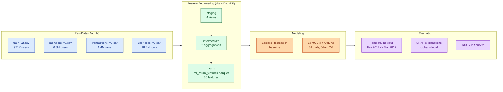

# KKBox Music Streaming Churn Prediction

[](https://github.com/mponsclo/music-streaming-churn-prediction/actions/workflows/lint.yml)
[](https://github.com/mponsclo/music-streaming-churn-prediction/actions/workflows/test.yml)
[](https://www.python.org/downloads/)
[](LICENSE)
[](https://github.com/astral-sh/ruff)
[](https://github.com/duckdb/dbt-duckdb)
[](https://lightgbm.readthedocs.io)

Predicting which users will churn from KKBox's music streaming service using the
WSDM Cup 2018 dataset. An end-to-end ML pipeline: from raw CSVs through dbt-powered
feature engineering to a tuned LightGBM model with SHAP explanations.

## Architecture



## Results

### Temporal holdout (the honest evaluation)

Trained on Round 1 (Feb 2017, 993K users), tested on Round 2 (March 2017, 971K users).
This mirrors the actual competition setup with no temporal leakage.

| Model | Log Loss | ROC-AUC | PR-AUC | F1 |
|-------|----------|---------|--------|-----|
| **LightGBM (temporal holdout)** | **0.267** | **0.924** | **0.604** | **0.578** |

The churn rate shifts from 6.4% (Round 1) to 9.0% (Round 2), reflecting real-world
distribution drift across months. The model maintains strong discrimination (0.924
ROC-AUC) but probability calibration degrades due to the distributional shift.

### Random split (within Round 2 only)

For completeness, the same model evaluated on a random 80/20 split of Round 2 data:

| Model | Log Loss | ROC-AUC | PR-AUC | F1 |
|-------|----------|---------|--------|-----|
| Logistic Regression (baseline) | 0.255 | 0.970 | 0.752 | 0.808 |
| LightGBM (Optuna-tuned) | 0.073 | 0.993 | 0.947 | 0.881 |
| LightGBM (behavioral features only) | 0.292 | 0.771 | -- | -- |

The gap between temporal (0.924) and random (0.993) ROC-AUC illustrates why
evaluation methodology matters. The random split inflates metrics because train
and test share the same temporal context. The temporal holdout reflects what
a deployed model would actually face.

### Feature Importance (SHAP)


Top predictors: subscription expiry timing, payment method, auto-renewal status,
and cancellation history. Listening behavior features (active days, engagement depth)
have modest but measurable effects.


## Problem

KKBox is Asia's leading music streaming service. A user "churns" if they do not
renew their subscription within 30 days after it expires. Predicting churn enables
targeted retention campaigns before users leave.

**Dataset**: [WSDM Cup 2018 KKBox Churn Prediction Challenge](https://www.kaggle.com/c/kkbox-churn-prediction-challenge) (v2 refresh)
-- 970,960 users across 4 data sources.

| Table | Rows | Description |
|-------|------|-------------|
| train_v2 | 970,960 | Target labels (msno, is_churn) |
| members_v3 | 6,769,473 | Demographics: age, gender, city, registration channel |
| transactions_v2 | 1,431,009 | Payment history: plan type, price, auto-renew, cancel |
| user_logs_v2 | 18,396,362 | Daily listening: songs played, completion rates, seconds |

Class balance: 91% retained / 9% churned.

## Approach

### 1. Exploratory Data Analysis

Interactive notebook ([notebooks/01_eda.ipynb](notebooks/01_eda.ipynb)) covering:
- Schema inspection and data quality audit (60% missing age, 11% missing demographics)
- Churn rate by demographics, registration cohort, and payment behavior
- The dominant signal: auto-renew + cancel status explains most of the variance
- Listening behavior distributions by churn status

All heavy queries run through DuckDB (the user_logs file is 1.3 GB).

### 2. Feature Engineering (dbt + DuckDB)

A full [dbt](https://www.getdbt.com/) project with the
[dbt-duckdb](https://github.com/duckdb/dbt-duckdb) adapter. The SQL-based pipeline
reads raw CSVs, cleans and transforms them through staging and intermediate layers,
and outputs a wide feature table as Parquet (see the architecture diagram above).

**36 features** across 4 groups:
- **Member**: age, gender, city, registration channel, tenure
- **Transaction snapshot**: last payment method, auto-renew, cancel, plan days, price per day
- **Transaction aggregates**: total transactions, cancellations, discounts
- **Listening behavior**: active days, total seconds, unique songs, completion rate, engagement depth
- **Data presence flags**: has_transaction_data, has_member_data, has_age

7 models, 16 schema tests, builds in ~16 seconds.

### 3. Modeling

**Baseline**: Logistic regression with balanced class weights, one-hot encoded categoricals,
and StandardScaler.

**Main model**: LightGBM with:
- `scale_pos_weight` for class imbalance (10:1 ratio)
- Native categorical feature handling (no one-hot encoding needed)
- Optuna hyperparameter tuning: 30 trials, 5-fold stratified CV
- Best params: 150 leaves, 0.096 learning rate, 944 boosting rounds

**Evaluation**: Log loss (primary), ROC-AUC, PR-AUC, and F1 at optimal threshold.

### 4. Explainability (SHAP)

TreeExplainer on 2,000 validation samples producing:
- Global importance bar plot
- Beeswarm plot showing feature value impact
- Waterfall plots for individual churner and retained user predictions

### Key Findings

1. **Subscription status dominates (and that's the real insight)**: Auto-renew users
   who haven't canceled churn at 1.8%, while canceled users churn at 79%. This is
   not data leakage -- cancellation is a deliberate user action before the churn
   window -- but it means the "prediction" is largely sorting users by how explicitly
   they've already signaled intent to leave.

2. **The genuinely hard problem is behavioral prediction**: Dropping all subscription
   metadata and using only listening patterns + demographics gives ROC-AUC 0.771.
   This is the model that would be most useful in practice (identifying at-risk
   users before they cancel).

3. **Listening behavior is surprisingly weak**: Among "normal" subscribers
   (auto-renew, no cancel), churners actually listen slightly more than retained
   users. Transaction and subscription features are far more predictive.

4. **Missing transaction data is a signal**: The 3.9% of users with no transaction
   history churn at 78.7%. These are likely users who already lapsed before the
   observation window.

5. **Non-standard plans nearly always churn**: 97.9% of users are on 30-day plans.
   The 2.1% on longer plans (90/180/365 days) have 96.7% churn -- these are all
   non-auto-renew promotional purchases that naturally expire.

## Project Structure

```
churn-pred/
├── config/
│   └── paths.py                  # Central path constants
├── src/
│   ├── data_loader.py            # DuckDB query helpers
│   ├── modeling.py               # Baseline + LightGBM + Optuna (random split)
│   ├── temporal_eval.py          # Round 1 -> Round 2 temporal holdout
│   └── evaluate.py               # Metrics, SHAP, plots
├── notebooks/
│   └── 01_eda.ipynb              # Exploratory data analysis
├── models/                       # dbt models
│   ├── staging/                  # 4 staging models (clean + cast)
│   ├── intermediate/             # 2 aggregation models (per-user features)
│   └── marts/                    # 1 mart model (wide feature table -> parquet)
├── macros/
│   └── safe_divide.sql           # Division-by-zero guard
├── outputs/
│   ├── figures/                  # All plots (EDA + evaluation + SHAP)
│   └── models/                   # Trained LightGBM model + Optuna study
├── tests/                        # pytest unit tests
├── docs/
│   ├── 0-glossary.md             # Every term used in the project
│   ├── 1-data.md                 # Schema + data quality
│   ├── 2-features.md             # dbt pipeline + feature catalog
│   ├── 3-modeling.md             # Baseline + LightGBM + Optuna
│   ├── 4-evaluation.md           # Temporal methodology + SHAP + limitations
│   ├── 5-experiments.md          # Experiment log
│   └── blog/                     # Deep-dive posts
├── .github/workflows/            # Lint + test CI
├── dbt_project.yml
├── profiles.yml
├── pyproject.toml                # Ruff config
├── .pre-commit-config.yaml
├── Makefile
├── requirements.txt
├── requirements-dev.txt
└── README.md
```

## Tech Stack

| Tool | Purpose |
|------|---------|
| Python 3.13 | Core language |
| DuckDB | CSV ingestion and heavy aggregations (handles 1.3 GB user_logs without loading into memory) |
| dbt (dbt-duckdb) | SQL-based feature engineering pipeline with tests and documentation |
| LightGBM | Gradient boosting classifier with native categorical support |
| Optuna | Bayesian hyperparameter optimization (30 trials, 5-fold CV) |
| SHAP | Model explainability (TreeExplainer) |
| scikit-learn | Baseline logistic regression, metrics, preprocessing |
| matplotlib + seaborn | Visualization |

## How to Run

```bash
# Install dependencies
make install          # or: pip install -r requirements.txt
make install-dev      # adds pytest, ruff, pre-commit

# Run the full feature + modeling + evaluation pipeline
make dbt-build        # dbt feature pipeline (staging -> intermediate -> marts)
make train            # Baseline + LightGBM + Optuna (random split)
make eval-temporal    # Honest temporal holdout: Feb -> Mar
make eval             # SHAP + ROC/PR plots

# Engineering checks
make lint             # ruff check + format --check
make test             # pytest
```

Run `make help` for the full list of targets. The EDA notebook can be opened
independently in JupyterLab or VS Code.

**Note**: Raw data files are not included in this repository (too large for git).
Download from the [Kaggle competition page](https://www.kaggle.com/c/kkbox-churn-prediction-challenge/data)
and place in the `data/` directory.

## Documentation

### Reading roadmap

Read the guides in order. The glossary is a reference, not required reading, but every term the numbered guides use is defined there.

1. **[0. Glossary](docs/0-glossary.md)** -- every term used in the project, defined once. Skim or search as needed.
2. **[1. Data](docs/1-data.md)** -- what the four source files look like, where the missingness lives, what signals are real.
3. **[2. Features](docs/2-features.md)** -- dbt layering, 36-feature catalog, schema tests.
4. **[3. Modeling](docs/3-modeling.md)** -- baseline + LightGBM + Optuna, with math and code for the core concepts.
5. **[4. Evaluation](docs/4-evaluation.md)** -- temporal holdout (canonical) vs random split, SHAP, limitations.
6. **[5. Experiments](docs/5-experiments.md)** -- per-run Config / Results / Diagnosis journal.

Deep-dive guides in table form:

| Guide | Content |
|-------|---------|
| [0. Glossary](docs/0-glossary.md) | Every technical term used in the project, defined in one place |
| [1. Data](docs/1-data.md) | KKBox schema, v2 refresh nuances, data quality audit (missingness, demographic issues) |
| [2. Features](docs/2-features.md) | dbt pipeline walkthrough, 36-feature catalog with definitions, macros |
| [3. Modeling](docs/3-modeling.md) | Baseline vs LightGBM, Optuna search space, scale_pos_weight rationale, final hyperparameters |
| [4. Evaluation](docs/4-evaluation.md) | Temporal holdout methodology, SHAP analysis, calibration vs discrimination, limitations |
| [5. Experiments](docs/5-experiments.md) | Raw experiment journal: every run with Config / Results / Diagnosis blocks |

Deep-dive posts:

- [Temporal vs Random Split: Why 0.993 ROC-AUC Meant Nothing](docs/blog/01-temporal-vs-random-split.md)

## References

- [WSDM Cup 2018: KKBox Churn Prediction](https://wsdm-cup-2018.kkbox.events/)
- [A Practical Pipeline with Stacking Models for KKBox's Churn Prediction](https://wsdm-cup-2018.kkbox.events/pdf/7_A_Practical_Pipeline_with_Stacking_Models_for_KKBOXs_Churn_Prediction_Challenge.pdf)
- [Kaggle Competition Data](https://www.kaggle.com/c/kkbox-churn-prediction-challenge/data)
