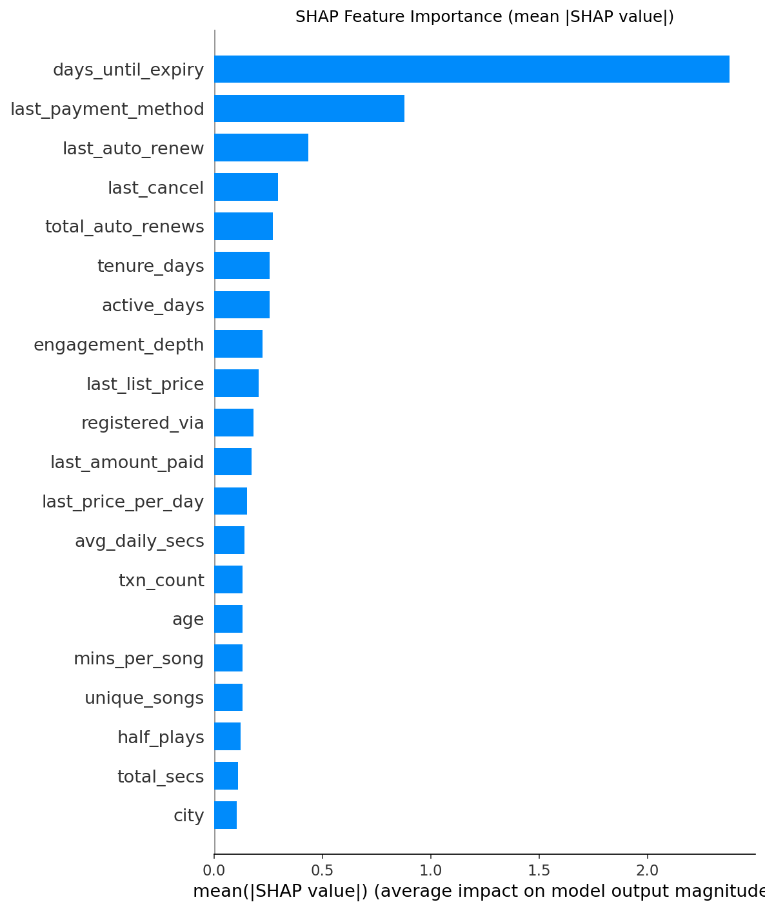
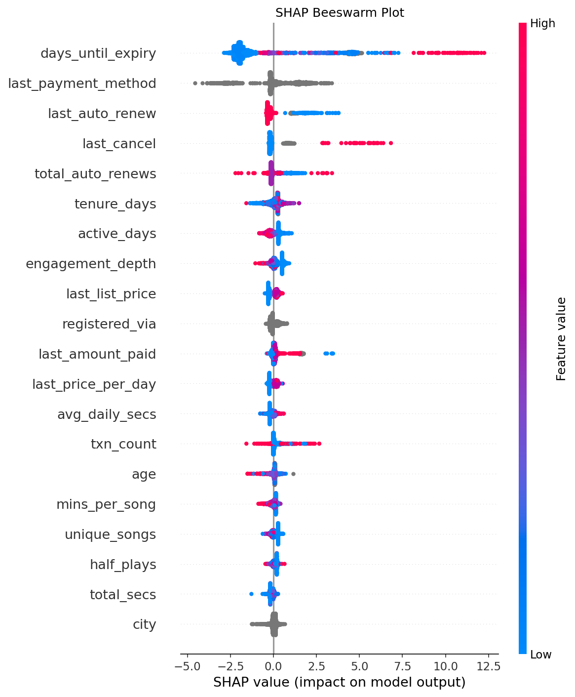
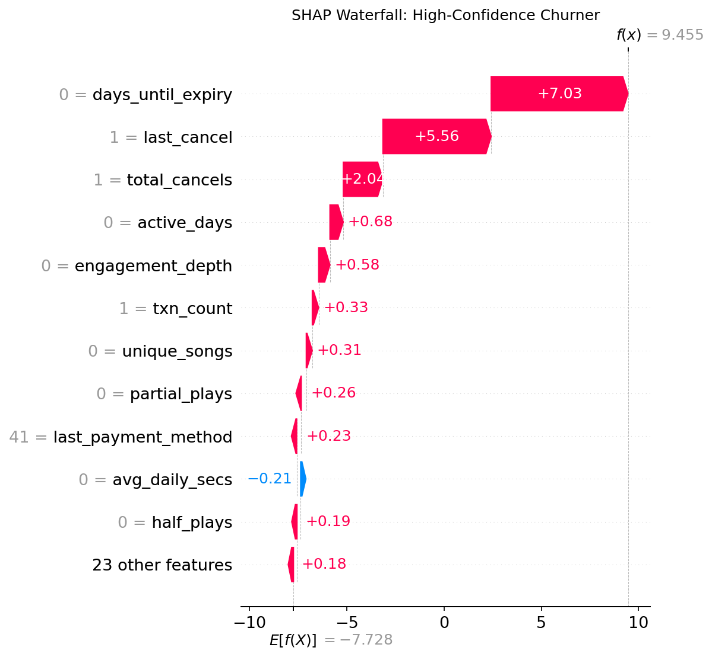
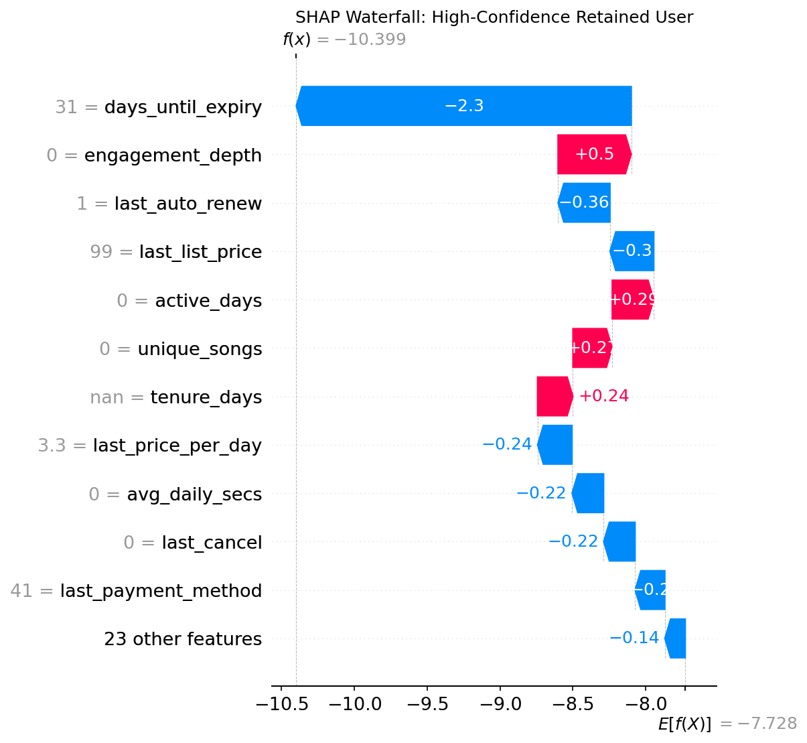
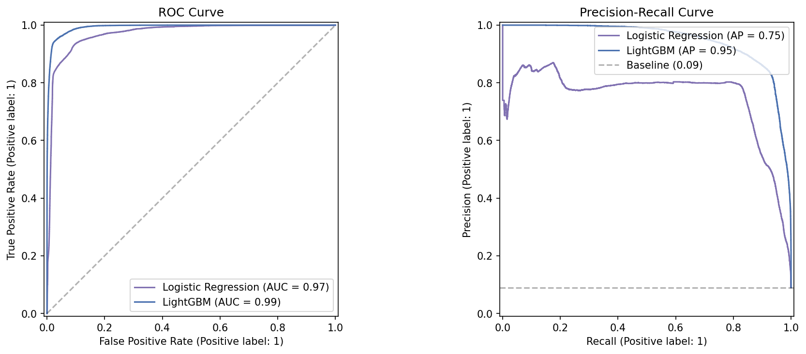

# 4. Evaluation

Two evaluation protocols, both reported honestly. The gap between them is the methodological point of this project.

## Temporal holdout (the canonical evaluation)

Mirrors the actual WSDM Cup 2018 setup:

- Train on Round 1 features (users expiring February 2017)
- Test on Round 2 features (users expiring March 2017)
- Features for each round are built independently from the raw files, so there is no leakage across the temporal boundary

```
Train Round 1: 992,931 users, 6.4% churn rate
Test  Round 2: 970,960 users, 9.0% churn rate
```

Churn rate shifts by +2.6 percentage points month over month. This is real distributional drift.

### Results

| Metric | Value |
|--------|-------|
| Log Loss | **0.267** |
| ROC-AUC | **0.924** |
| PR-AUC | **0.604** |
| F1 (optimal threshold) | **0.578** |

`python src/temporal_eval.py` reproduces these numbers.

### Why this is the honest number

Random cross-validation (and a random 80/20 split) both assume train and test are drawn from the same distribution. Churn prediction is a time-dependent problem, so that assumption is false. Temporal holdout enforces it by construction.

## Random split (upper bound under no drift)

For completeness, the same LightGBM evaluated on a random 80/20 split of Round 2 only:

| Model | Log Loss | ROC-AUC | PR-AUC | F1 |
|-------|----------|---------|--------|-----|
| Logistic Regression (baseline) | 0.255 | 0.970 | 0.752 | 0.808 |
| **LightGBM (Optuna tuned)** | **0.073** | **0.993** | **0.947** | **0.881** |
| LightGBM (behavioral only) | 0.292 | 0.771 | -- | -- |

### The 0.993 vs 0.924 gap

Two ROC-AUC values for the same model, differing by 0.069. This is a 69% reduction in the gap from random (0.5) to perfect (1.0).

See [blog/01-temporal-vs-random-split.md](blog/01-temporal-vs-random-split.md) for the deep-dive.

The short version: random split inflates ROC-AUC because train and test share the same temporal context. Temporal holdout removes that context overlap and surfaces what a deployed model would actually face in production. The random-split number is an upper bound; the temporal number is the expected one.

### Calibration vs discrimination

ROC-AUC degrades from 0.993 to 0.924 (-7%). Log loss degrades from 0.073 to 0.267 (+266%). The ranking ability of the model holds up reasonably well across the temporal boundary; its probability calibration does not. In production, this suggests:

- Relative targeting (top-N at-risk users) remains reliable
- Decision thresholds calibrated on random-split probabilities would miscount at-risk users in absolute terms
- Monitoring should track calibration error (Brier score, reliability diagrams) separately from ROC-AUC

## Feature importance (SHAP)

TreeExplainer on 2,000 validation samples, random-split model.

### Global importance



Top predictors are dominated by subscription metadata:
- `last_cancel`, `last_auto_renew`
- `days_until_expiry`
- `last_plan_days`
- `last_payment_method`

Listening behavior features (`active_days`, `total_secs`, `completion_rate`) have measurable but modest effects.

### Beeswarm plot



Shows the direction of feature effects. Red (high feature value) vs blue (low) separation indicates how the feature shifts churn probability.

### Individual predictions

Waterfall plots for one churner and one retained user illustrate how individual feature values combine into a prediction:




## ROC and PR curves



Random-split evaluation. Both curves clearly above the no-skill baseline.

## Threshold selection

F1 is reported at the optimal threshold found by sweeping `np.arange(0.05, 0.95, 0.01)`. For production deployment, the threshold should instead be chosen by business constraints (e.g., retention campaign cost per contact vs expected revenue saved per retained user), not by F1 maximization.

## See also

- Full experiment journal: [5. Experiments](5-experiments.md)
- Deep dive on the temporal vs random split gap: [blog post](blog/01-temporal-vs-random-split.md)
